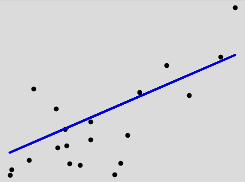
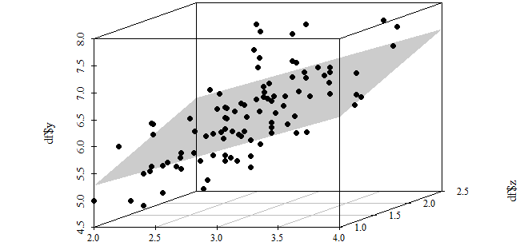

# LINEAR MODELS

## 1. REPRESENTATION
**How the model transforms $X$ into $Y$**

- **The Equation**: $Y = w_1x_1 + w_2x_2 + \dots + w_nx_n + b$
- **Behavior**: It represents an increasing or decreasing relationship. While the fundamental relationship is linear, feature engineering can sometimes introduce curves (polynomials).
- **Types**: Linear, Quantile, Huber, Ridge, Lasso, ElasticNet, Tobit and more.

---

## 2. VISUALIZATION IDEA (EDA)
**How dimensions change the model's shape**

* **1 Feature (Straight Line)**: A unidimensional relationship visualized in a 2D plane.
    
* **2+ Features (Hyperplane)**: A multidimensional relationship. With 2 features, it forms a **Plane** (3D); with 3+, it forms a **Hyperplane**.
    

---

## 3. PARAMETERS
**The internal values that define the model**

| Parameter | Symbol | Description |
| :--- | :---: | :--- |
| **Coefficients** | $w_n$ | The **weight** or contribution of each feature. Defines the **slope** and direction of the line. |
| **Bias** | $b$ | The **intercept**. An adjustment that defines where the line crosses the Y-axis (starting point). |

---

## 4. LOSS FUNCTIONS & REGULARIZATION
**The "Compass" of the model (how it learns and handles complexity)**

### 🔹 Error-Based (Loss)
* **Loss** = error
* **MSE**: Penalizes big mistakes (sensitive to outliers).
* **MAE**: Penalizes all errors equally (robust to outliers).
* **HUBER**: The best of both worlds (MSE for small errors, MAE for large ones).
* **TOBIT**: For censored data

### 🔹 Penalty-Based (Regularization)
* **Loss** = error + regularization
* **L2**: Shrinks coefficients to handle multicollinearity (keeps all features).
* **L1**: Can zero out coefficients (useful for feature selection).
* **ELASTIC NET**: A hybrid of L1 and L2 for complex datasets.

## 5. OPTIMIZATION ALGORITHMS
**Techniques and methods used for adjust the parameters values from a model**

### Methods based on gradients
* **GRADIENT DESCENT**: 
* **BATCH GRADIENT DESCENT**:
* **STOCHASTIC GRADIENT DESCENT**:
* **MINI-BATCH GRADIENT DESCENT**:

###

## 6. HYPERPARAMETERS

## 7. EVALUATION METRICS