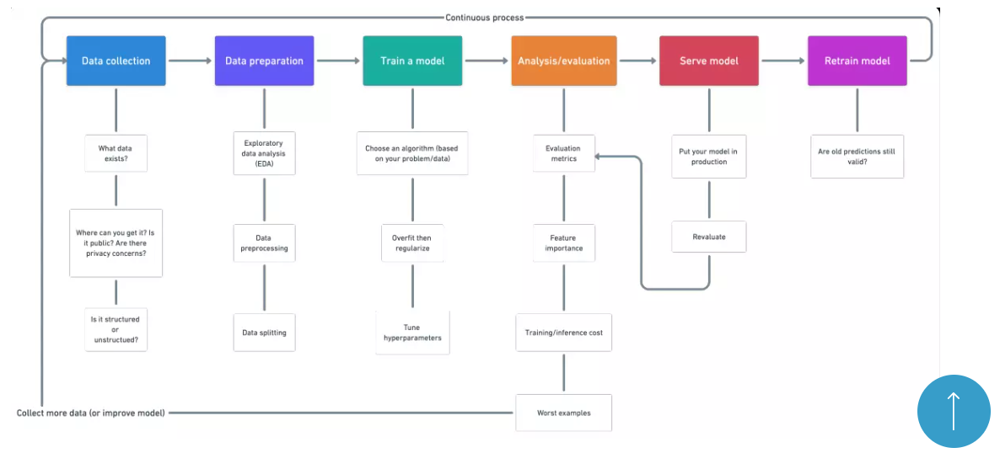

_HOW TO THINK LIKE A PROFESSIONAL, TO DO MACHINE LEARNING PROJECTS?_

# 1. ANALYZE THE SITUATION (For what we're searching, what is the objective? How we are gonna use that?)

# 2. GET THE DATA (Import the data in the envoriment) 

# 3.  IDENTIFY AND VISUALIZE THE DATA TO GET IMPORTANT INFORMATIONS (Identify the priorites in the dataset and select the features in the dataset)
**CONSTANT FEATURE**
- The value are the sames, doesn't change, are irrelevant features to the model

**REDUNDANT FEATURE**
- Two features have the same information in diferrent data
- Weight (meters (m) ), (centimeters (cm) ) and etc

**High correlation**
- !Sometimes a feature doesn't have a hight correlation with the label, but have with others features, so we delethe that feature (!DEPENDING THE MODEL AND THE OBJECTIVE!) !
- HEATMAP 2 DIMENSIONAL TABLE, TO SEE THE CORRELATION, the HEATMAP IT'S MORE EFFECTIVE TO NUMERICAL FEATURES, so we need to do a pre-select features, or 'delete' some str and object features
- It's more common we use create a new df to heatmap 'df_heatmap' just with number features, and then use seaborn

**Cardinality** 
- Some features have a high cardinality, so depending on the model it's better to delete theses data
- See all the values per features, and then see which feature have the high cardinality and then delete the feature (depeding) with a pandas option (.nunique)

**NULL VALUES**
- High null features values (some features have a high null values, so we need to delete the SAMPLES who doesn't have the value)
- See all the values per features, and then see which feature doesn't agree with the other and then DELETE THE SAMPLES WITH THE NULL VALUES
- See only the null values with pandas options and then delete the SAMPLES WITH THE NULL VALUES with pandas (.dropna)

# 4. PREPARE THE DATA FOR THE ML ALGORITHMNS (Separate the data, in test, train, validation and more)

# 5. SELECT AND TRAIN THE MODEL (Analyze the models, identify who is better and train the modelsupervised or not, regression or classification, batch (offline) or online, per instancies (similar) or per model (maths) )

# 6. IMPROVE THE MODEL See the erros, and try to improve the error accurancy, here goes the news predicr (with scikit model.predict) and after visualyze the performance measure (MRSE, MAE and more)
And after, select news hyperparameters or something to improve the error measure

# 7. SHOW THE SOLUTION Share to the other people and the manager
# 8. PUBLIC THE SYSTEM, ANALYZE AND ADJUST Publish to the internet, and see how goes work with new instancies

# FLOWCHART
