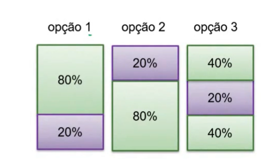
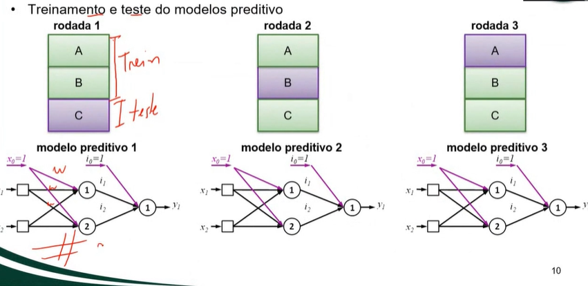

_HOW TO THINK LIKE A PROFESSIONAL, TO DO MACHINE LEARNING PROJECTS?_

# 1. ANALYZE THE SITUATION 
### 1.1 QUESTIONS?
**What's the real problem?**

**What's the final objective?**
- Predict: numbers
- Classifier: classes/groups
- Recommend
- Found patterns

**How the model will be used?**
- A people or a system will use?
- Need to be fast

**Wich type of data will be used?**
- Real time or historic
- Supervised or non-supervised
- How the dataset it's defined (big or small) (have null values, skewed data or outliers)

**The model have restrictions?**
- Memory
- Time
- Money

**The model in the future**
- Problem will be changed?
- New data will come?

**Define the systems of the machine learning project**
- A (supervised or other)
- B (batch or offline)
- C (instances or modules)
- D (dataset split: holdout, crossvalidation, kfold, stratified and etc)
- E (model strategy (not the final model): linear regression, logistic and etc)
- F (perfomance measure: RMSE, MAE and etc)

# 2. GET THE DATA (Import the data in the envoriment) 
**Where's the data comes**
- Kaggle's suport
- A database
- A file

# 3.  IDENTIFY, VISUALIZE AND PREPROCESSING THE DATA TO MODEL.

### 3.1 EXPLORATORY DATA ANALYSIS (EDA) 

**CONSTANT FEATURE**
- DEFINITON: Are features that have all the same value for all the samples, they don't have a variability, so don't have a value to predict
- CHARACTERISTICS: Can be numeric, object or something else
- EXAMPLE: Country: 1. BR 2. BR 3. BR 4. BR

**REDUNDANT FEATURE**
- DEFINITION: Are more than one feature which contains the same data in a different way.
- CHARACTERISTICS: Can be in differents units (cm or meter)
- EXAMPLE: Weight: 100cm // 1 meter

**CATEGORIAL FEATURES**
- DEFINITION: Features that represents classes or objects and not numerics continuous, the model can't learning without numeric values, so it's necessary analyses that
- CHARACTERISTICS: 
1. Can be string, object or category;
2. They can be very important or useless;
3. Nominal (no order of importance) or Ordinal (with order of importance)
- EXAMPLE: Country: BR, US, GER (nominal feature) // Position: Boss, employeer, trainee (ordinal feature)

**TIME FEATURES**
- DEFINITION: Features that represents time or dates 
- CHARACTERISTICS:
1. Can be object, datetime or int datatype
2. Frequency (daily, monthly or annual)
- EXAMPLE: (01/01/2026 2024-08-15 14:32:10 timestamp) 
1. If we put these datas like int, can be 20200101 and 20201231, and a model can think that 20200101 < 20201231

**DUPLICATES**
- DEFINITION: Are repeated samples, here's the problem are rows and not the features
- CHARACTERISTICS: Can be all the fatures repeated, or some only
- EXAMPLE: SAMPLE 1: 1, 2, 3, 4 // SAMPLE 2: 1, 2, 3, 4 (all the features) //
SAMPLE 3: 1,2,2,4 (some only)

**CARDINALITY** 
- DEFINITION: A feature with high quantity of differents labels or targets (it's much more common in categorial features)
- CHARACTERISTICS: Some numeric features have a high cardinality, and this don't harm the model, so it's more for categorial.
- EXAMPLE: FEATURE X: LION, CAT, DOG, WHALE, ANT, BUG (AND MORE 100 EXAMPLES), all presents in one single feature 

**NULL VALUES**
- DEFINITION: Are missing values in the dataset.
- CHARACTERISTICS: The null valeus isn't a 0, or '' string, just doens't exist like a ghost value
- EXAMPLE: 5 features: 1, 2, 3, ,5 (one feature is missing)

**HIGH CORRELATION**
- DEFINITION: Features with a correlation in the data between them (if one increases, the other also increases.) 
- CHARACTERISTICS: 
1. +1 and -1 are the maximum values that features can have, positives it's when they increase together, negative it's when one increase and the other decrease
2. When features are too correlation, when we can do a feature engineering, trying to improve the model.
3. If the correlation between a feature and the target it's bad, we can delete it, focus to improve the model ()
4. To see the correlation it's better to do a HEATMAP
5. The correlation just can be acessed with NUMERIC VALUES, so objects, string and more goes be an error
- EXAMPLE: TARGET: house_price // FEATURE: total_roomns // CORRELATION: 0.6

**SCALE AWARENESS**
- DEFINITION: The difference between the valeus of the features, e the impact about this data in the model.
-  CHARACTERISTICS: 
1. Without a scaling, a model can think that big numbers are more imporants them small numbers
2. Harm models based in median or gradient (linear regression, nn and more)
- EXAMPLE: Age: 50 // Wage : 100.000, in this case the model can give more importance to the wage because the big numbers, and harm the model 

**NEGATIVE DATA**
- DEFINITION: Features with negatives values.
- CHARACTERISTICS: 
1. Not necessarily an error, in some case are (it makese sense un real life?)
2. Can be VALID (weather, profit, variaton and more) or INVALID (error)
- EXAMPLE: Weather = -48 (valid) // Age = -39 (invalid)

**SKEWED DATA**
- DEFINITION: Occurs when data distribution it's not symmetrical, pull to one side (right-skewed or left-skewed)
- CHARACTERISTICS: It's not an error, but can harm the model
- EXAMPLE: 90 persons has 10k wage, 10 persons has a 100k wage, the media it's a unreal number, because the 10 persons, change the values.

**OUTLIERS**
- DEFINITION: Values presents in the data, that are completely different from the others, extreme or minimal, and this can harm the model
- CHARACTERISTICS:
1. Normally are few values
2. Different from the skewed that are a most, outliers are a few.
- EXAMPLE: Height: 1.90, 1.91, 1.85. 5.00 -> these are a outlier

**FEATURE ENGINEERING**
- DEFINITION: The process of select, transform and create new feature (unreal), based in real features, trying always to improve the model.
- CHARACTERISTICS: Involves thinking and know about the data
- EXAMPLE: Instead have 2 features: weigth and height // we can do a IMC feature = weight + height

**TARGET BALANCE**
- DEFINITION: Verify and ensure the balance of target, to see if the targets (y) are well distributed or not
- CHARACTERISTICS: 
1. It's more common in classifier problems
2. Can contains rares targets
- EXAMPLE: 90% of the targets are 'spam' and 10% are 'not spam' 

### 3.2 CHANGE AND TRANSFORM THE DATA (PREPROCESSING) 

**CONSTANT FEATURE**
- TREAT: REMOVE
- REMOVE: .drop(columns = [])

**REDUNDANT FEATURE**
- TREAT: Analyses and choose the feature who it's more advantageous, and remove the other, or just maintain  both
- REMOVE: .drop(columns = [])

**CATEGORIAL FEATURES**
- TREAT: Verify the cardinality and null values, if are to high we remove, altough if we don't have that, we have to put it into numeric values.
- VISUALIZE: BARPLOT, COUNTPLOT
- REMOVE: df.drop(columns = []) // + .value_counts()
- TRANSFORM: ENCODING ALGORITHMS (ONE-HOT-ENCODING or  ORDINAL-ENCODING -> based on the type of data ordinal or nominal) 

**TIME FEATURES**
- TREAT: Convert into datetime data and then, verify cardinality, null values, sort them and see if it's relevant feature to remove or maintain
- VISUALIZE: LINE PLOT, ROLLING MEAN PLOT
- CONVERT: .to_datetime()
- CARDINALITY: .nunique()
- NULL VALUES: isnull() + .sum()
- SORT: .sort()
- REMOVE: .drop(columns = [])

**DUPLICATES**
- TREAT: Check if are duplicated samples (rows) or duplicated values in the features, so check if this duplicated are relevant data or not
- DUPLICATES: .duplicated() + .sum()
- REMOVE: .drop(columns = [])
- OTHER WAY TO REMOVE: .drop_duplicated(subset = [])

**CARDINALITY** 
- TREAT: Check the difference between the data in the features, if it's to high, we need to analyze and if necessary remove it
- CARDINALITY: .nunique() // dataset['column'].nunique() // dataset['column'].value_counts()
- REMOVE: .drop(columns = [])

**NULL VALUES**
- TREAT: Check if we have null values, so them remove the samples with this missing data, if are a lot of samples, we remove the feature with that high value with null data
- VISUALIZE: BARPLOT
- NULL: .isnull() // .isnull() +.sum()
- REMOVE: .drop(columns = [])

**HIGH CORRELATION**
- TREAT: Check the correlation, and we can check if we can remove or do something (only numeric numbers works, so we need to transform if we have to numeric numbers all the features)
- VISUALIZE: HEATMAP: sns.heatmap(), PAIRPLOT, SCATTER PLOT + HUE
- CORRELATION: .corr() 
- REMOVE: .drop(columns = [])

**SCALE AWARENESS**
- TREAT: Check the different between the values (range, magnitude, units) and apply STARDANTIZATON OR NORMALIZATION
- VISUALIZE: HISTOGRAMS, BOXPLOT
- DIFFERENT SCALES: .describe()
- STANDARDIZATION: StandardScaler() (sklearn)
- NORMALIZATION: MinMaxScaler() (sklearn)

**NEGATIVE DATA**
- TREAT: Check if data makes sense, if makes ok, doesnt change, but not we need to remove or transform
- VISUALZIE: HISTOGRAM, BOXPLOT, KDEPLOT, SCATTERPLOT
- REMOVE: .drop(columns = [])

**SKEWED DATA**
- TREAT: Check the asymmetric, if have, right or left, and then remove these data (extreme values) or drop rows with unrealistic outliers
- VISUALIZE: HISTOGRAM, BOXPLOT, VIOLINPLOT, SCATTERPLOT
- SKEWED: .skew()
- REMOVE: .drop(columns = [])

**OUTLIERS**
- TREAT: Check if have, and them remove if's necessary
- VISUALIZE: SCATTER AND BOXPLOT
- CHECK OUTLIERS: BOXPLOT
- REMOVE: .drop(columns = [])

**FEATURE ENGINEERING**
- TREAT: Create and transform exist features in new features, or just delete it
- VISUALIZE: HEATMAP, HISTOGRAM, SCATTER
- CREATE: dataset['new_feature'] = dataset['feature_one'] + dataset['feature_two']

**TARGET BALANCE**
- TREAT: Verify if the balance are OK
- VISUALIZE: BARPLOT, COUNTPLOT,
- CHECK BALANCE: .values_counts (the target feature)

--------------------PLOTS NECESSARYS TO EXPLORE THE DATA---------------------
- JOINTPLOT
- STRIPLOT/SWARMPLOT
- RIDGELINEPLOT
- HEXBIN PLOT
- BOXPLOT GROUPED
- CDF/ ECDF PLOT
- HEATMAP DE MISSING VALUES
- AUTOCORRELATION PLOT
- RADAR, PARALLEL, PCA SCATTER, CLUSTERMAP

--------------------------------- PART 2 ----------------------------
- Correlation → heatmap, pairplot, jointplot, hexbin
- Distribution → hist, kde, ecdf, ridgeline
- Categorical → countplot, stripplot, box grouped
- Outliers → box, violin, scatter, hexbin
- Time → line, rolling mean, autocorrelation
- Missing → missing heatmap

----------------------------------------.---------------------------------------------------

# 4. PREPARE THE DATA FOR THE ML ALGORITHMNS (Separate the data, in test, train, validation and more)
**THERE ARE DIFFERENTS PARTS FOR THE DATA IN A MACHINE LEARNING MODE, AND WE'LL GO EXPLORE ALL OF THESE STEPS RIGHT NOW**

### 4.1 WHY AND HOW STARING?
**WHY WE NEED TO SEPARE THE DATASET IN LITTLE DATASETS?**
- A model can learning, and can also memorize the data, or do something else that harm the model to be efective (over and underfitting)
- To avoid these thing of situation and improve the model learning, we split in split datasets, to test, train, verify and more things, that garanted greater power to the model and data

**HOW TO STARTING**
- We need to separe in X  and Y variables
- The X variable contains the independent features, and the Y the dependent features
- We can use the .drop() from pandas to remove the dependent features (to get the X data)
- And also we use x['y'] to get the Y feature

**RANDOM SEED**
- A way in functions that generate a random choose of the data
- DATASET ->(1,2,3,4,5)
- RANDOM 2 -> (2,4,3,5,1)
- RANDOM 33 -> (1,3,5,4,2)

### 4.2 TYPES OF SET
**TRAINING SET**
- Part of the dataset that will be used to train the model
- Adjust the bias and wight
- Forward, loss, backpropagation
- Gradient descent
- 60-80% of the data
- train_test_split() from sklearn

**VALIDATION SET**
- Part of the dataset where we'll avaliation the train step, to see if are memorizing or learning
- In this steep it's to avaliable the hyperparameters
- We can check also, if the model have troublesl like under and overfitting
- 10-20% of the data

**TESTING SET**
- Part that will avaliable the model with new instancies (samples)
- Calculate the generelazation
- 10-20% of the data

### 4.3 STRATEGIES TO SPLIT THE SET'S
**HOLDOUT**
- Divide it only once the dataset, each part have a fixed role
- Used in medium/big datasets
- Simple, fast and easy
- We can use with SKLEARN train_test_split
- *But in small datasets, may not represent well*

**K-FOLD CROSS VALIDATION**
- Divide in k trains, in each train the dataset it's splited in a different way
- And after verify the accurancy of each train
- the test set, stay separate
- Used in small/medium datasets
- Compare models with more efficiency, but more slow
- We can use with SKLEARN KFold

**STRATIFIED SPLIT**
- Only used in classes problems
- A way to split the data that garanted proportion
- Train: 72 gatos / 8 cachorros
- Validation: 9 gatos / 1 cachorro
- Test: 9 gatos / 1 cachorro
- We can use with SKLEARN StratiedKFold

#### 4.4 PROBLEMS
**DATA LEAKAGE**
- It's when a data that should be unavailable at training test, leaks at the model
- Test data to train data, and more
- The model goes with a high accurancy, a overfitting case (high accurancy with data leakage means nothing)

# 5. SELECT AND TRAIN THE MODEL (Analyze the models, identify who is better and train the modelsupervised or not, regression or classification, batch (offline) or online, per instancies (similar) or per model (maths) )

### 5.0 GERAL

### 5.1 SYSTEM A

#### 5.2 SYSTEM B

### 5.3 SYSTEM C

# 6. IMPROVE THE MODEL See the erros, and try to improve the error accurancy, here goes the news predicr (with scikit model.predict) and after visualyze the performance measure (MRSE, MAE and more)
And after, select news hyperparameters or something to improve the error measure

# 7. SHOW THE SOLUTION Share to the other people and the manager
# 8. PUBLIC THE SYSTEM, ANALYZE AND ADJUST Publish to the internet, and see how goes work with new instancies

# FLOWCHART
